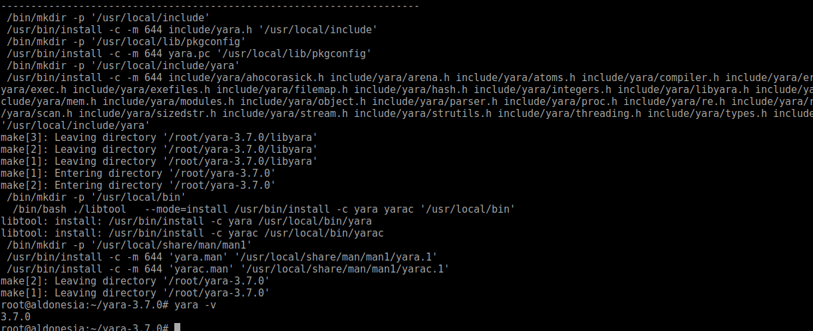
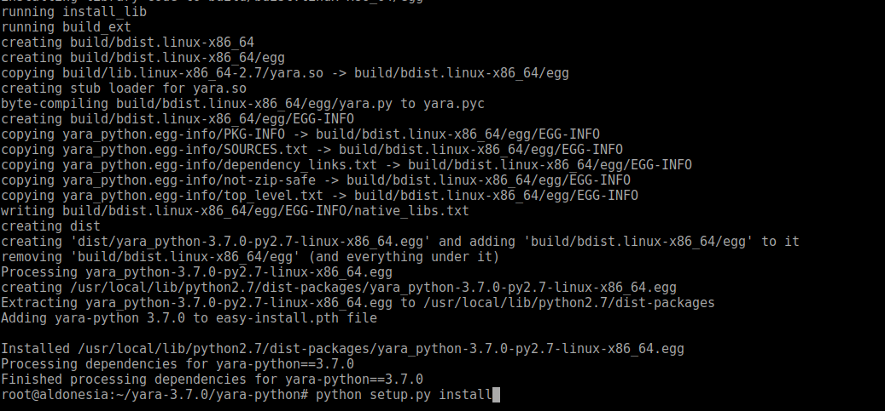
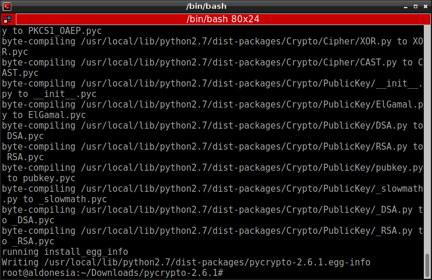
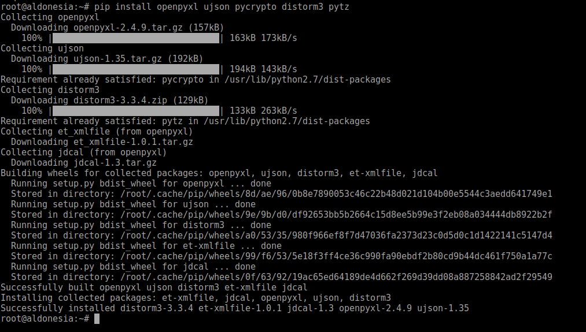
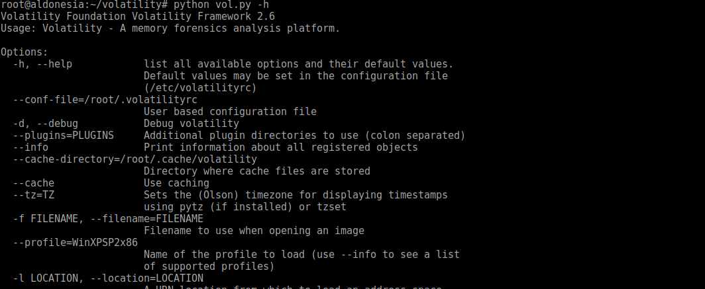
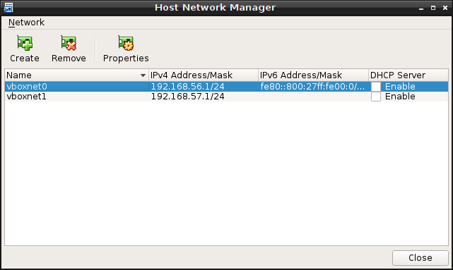
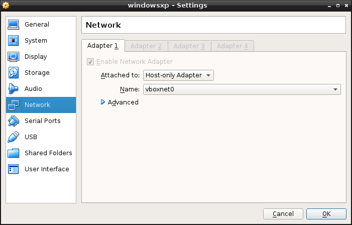
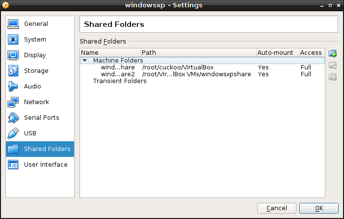
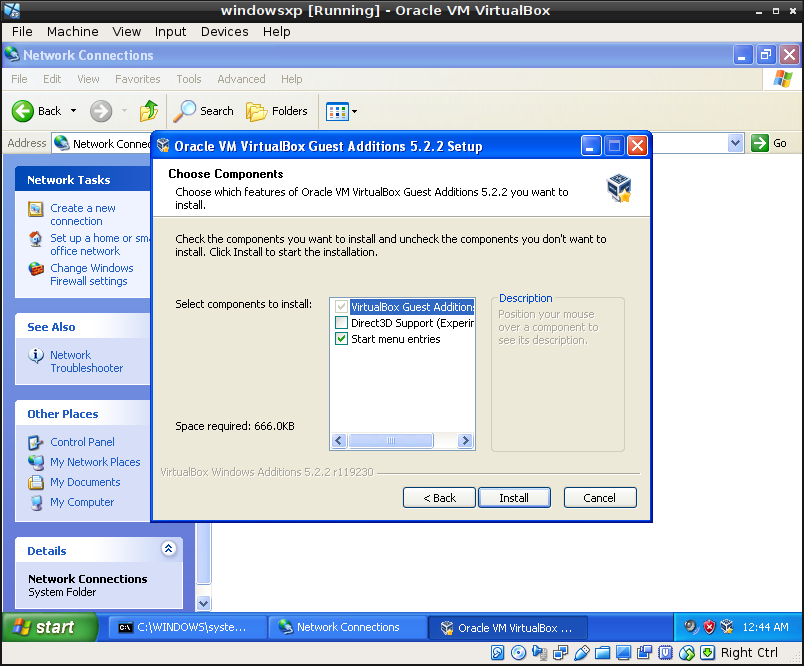
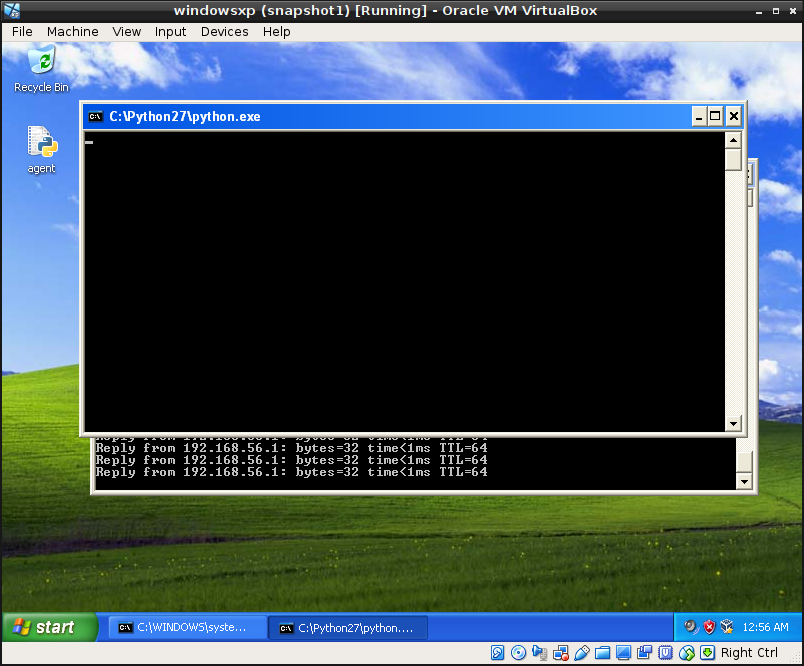

## DASAR TEORI
* **Cuckoo Sandbox** adalah 
Cuckoo Sandbox adalah sistem analisis malware otomatis yang bersifat open-source. User dapat melempar file yang mencurigakan ke Cuckoo dan dalam hitungan menit Cuckoo akan memberikan laporan terperinci yang menguraikan perilaku file saat dijalankan di dalam lingkungan yang realistis namun terisolasi.
(cuckoosandbox.org)

* **Malware** adalah 
perangkat lunak yang diciptakan untuk menyusup atau merusak sistem komputer, server atau jejaring komputer tanpa izin (informed consent) dari pemilik.
(https://id.wikipedia.org/wiki/Perangkat_perusak)

* **Ssdeep** adalah 
program untuk computing context triggered piecewise hashes (CTPH). Disebut juga hash fuzzy, CTPH bisa mencocokkan input yang memiliki homolog. Masukan tersebut memiliki urutan byte identik dalam urutan yang sama, meskipun byte di antara urutan ini mungkin berbeda pada konten dan panjang.
(https://ssdeep-project.github.io/ssdeep/index.html)

* **Yara** adalah 
program yang ditujukan untuk membantu periset malware untuk mengidentifikasi dan mengklasifikasikan sampel perangkat lunak perusak. Dengan YARA Anda bisa membuat deskripsi keluarga malware (atau apapun yang ingin Anda jelaskan) berdasarkan pola tekstual atau biner.
(https://virustotal.github.io/yara/)

* **Volatility** adalah 
Volatility Framework adalah kumpulan alat yang bersifat open-source, diimplementasikan dengan Python di bawah GNU General Public License, untuk ekstraksi artefak digital dari sampel volatile memory (RAM). Teknik ekstraksi dilakukan sepenuhnya independen dari
sistem sedang diselidiki tapi menawarkan visibilitas ke keadaan runtime dari sistem Kerangka ini dimaksudkan untuk mengenalkan orang kepada teknik dan kompleksitas yang terkait dengan penggalian artefak digital dari sampel memori yang mudah menguap dan menyediakan platform untuk pekerjaan lebih lanjut daerah penelitian yang menarik ini.
(https://github.com/volatilityfoundation/volatility)

* **Distorm** adalah 
sebuah program dekomposer, yang berarti dibutuhkan sebuah instruksi dan mengembalikan struktur biner yang menggambarkannya daripada teks statis.
(https://github.com/gdabah/distorm/wiki)

* **Pycrypto** adalah 
kumpulan dari kedua fungsi hash aman (seperti SHA256 dan RIPEMD160), dan berbagai algoritma enkripsi (AES, DES, RSA, ElGamal, dll.). Paket ini disusun untuk mempermudah penambahan modul baru. Bagian ini pada dasarnya lengkap, dan antarmuka perangkat lunak hampir pasti tidak akan berubah dengan cara yang tidak kompatibel di masa depan; Yang masih harus dilakukan adalah memperbaiki bug yang muncul.
(https://pypi.python.org/pypi/pycrypto)

* **Mitmproxy** adalah 
Program konsol interaktif yang memungkinkan arus lalu lintas disadap, diperiksa, dimodifikasi dan diputar ulang.
(https://mitmproxy.org/)

* **Ransomware Locky** adalah
perangkat lunak ransomware yang diluncurkan pada tahun 2016. Terlibat aktif pada tahun 2017, dikirimkan melalui email (yang diduga merupakan faktur yang memerlukan pembayaran) dengan dokumen Microsoft Word terlampir yang berisi macro jahat. Saat pengguna membuka dokumen, file tersebut tampaknya penuh dengan sampah, dan itu termasuk frase "Aktifkan makro jika pengkodean data tidak benar,". Jika pengguna mengaktifkan makro, makro kemudian menyimpan dan menjalankan file biner yang mendownload trojan enkripsi sebenarnya, yang akan mengenkripsi semua file yang cocok dengan ekstensi tertentu. Nama file diubah menjadi kombinasi huruf dan angka 16 yang unik dengan ekstensi file .locky. Setelah enkripsi, sebuah pesan (ditampilkan di desktop pengguna) menginstruksikan mereka untuk mendownload browser Tor dan mengunjungi situs Web yang dioperasikan dengan pidana tertentu untuk informasi lebih lanjut. Situs web berisi petunjuk yang meminta pembayaran antara 0,5 dan 1 bitcoin (pada bulan November 2017, satu bitcoin bervariasi antara $ 9.000 dan $ 10.000 melalui pertukaran bitcoin). Karena penjahat memiliki kunci pribadi dan server remote dikendalikan oleh mereka, korban dimotivasi untuk membayar untuk mendekripsi file mereka.
(https://en.wikipedia.org/wiki/Locky)

## Keterangan
disini kami menggunakan OS DEBIAN 9.1 sebagai OS untuk instalasi cuckoo dan telah login sebagai root dan menggunakan windows xp pada virtual box 5.2 sebagai target malware.

## Pra-Instalasi Cuckoo
  1. Install aplikasi dan library yang dibutuhkan untuk menginstall cuckoo
  ```
  $ apt install git mongodb libffi-dev build-essential python-django python python-dev python-pip python-pil python-sqlalchemy python-bson python-dpkt python-jinja2 python-magic python-pymongo python-gridfs python-libvirt python-bottle python-pefile python-chardet tcpdump python3-pip python3-dev libssl-dev libtiff5-dev libjpeg62-turbo-dev zlib1g-dev libwebp-dev autoconf libtool-bin -y
  ```
  

  2. Mengizinkan tcpdump agar dapat diakses oleh root
  ```
  $ setcap cap_net_raw,cap_net_admin=eip /usr/sbin/tcpdump
  ```
 
 
  3. menginstall ssdeep
  ```
  $ wget http://sourceforge.net/projects/ssdeep/files/ssdeep-2.12/ssdeep-2.12.tar.gz
  $ tar xvzf ssdeep-2.12.tar.gz
  $ cd ssdeep-2.12
  $ ./configure && make && make install
  $ git clone https://github.com/kbandla/pydeep
  $ cd pydeep
  $ python setup.py build
  $ python setup.py install
  ```
  
  
  4. install yara
  ```
  $ wget https://github.com/VirusTotal/yara/archive/v3.7.0.tar.gz
  $ ./bootstrap.sh
  $ ./configure --with-crypto --enable-cuckoo --enable-magic
  $ make && make install
  ```
  
  ```
  $ git clone --recursive https://github.com/VirusTotal/yara-python
  $ cd yara-python
  $ python setup.py build
  $ python setup.py install
  ```
  
  
  5. install distorm
  ```
  $ wget https://github.com/gdabah/distorm/archive/v3.3.4.tar.gz
  $ tar -xvzf distorm-3.3.4.tar.gz
  $ cd distorm-3.3.4
  $ python setup.py install
  ```
  
  
  6. install pycrypto
  ```
  $ wget https://pypi.python.org/packages/60/db/645aa9af249f059cc3a368b118de33889219e0362141e75d4eaf6f80f163/pycrypto-2.6.1.tar.gz
  $ tar -xvzf pycrypto
  $ cd pycrypto
  $ python setup.py build
  $ python setup.py install
  ```
  
  
  7. Install Volatility
    7.A Install aplikasi prasyarat untuk menginstall volatility
        ```
        $ pip install openpyxl ujson pycrypto jupyter pytz
        ```
        
    7.B Install Volatility
        ```
        $ git clone https://github.com/volatilityfoundation/volatility.git
        $ cd volatility
        $ python setup.py build
        $ python setup.py install
        $ python vol.py -h
        ```
        
    
  8. Install mitmproxy
  ```
  $ pip3 install mitmproxy
  ```
   
  9. Install Virtualbox
  ```
  apt install virtualbox-5.2
  ```
  
   
## Instalasi Cuckoo
  1. Install Cuckoo
  ```
  $ pip install -U pip setuptools
  $ pip install -U cuckoo
  ```
  
  2. Menambahkan User baru bernama cuckoo
  ```
  $ useradd cuckoo
  ```
  
  3. Buat permission untuk yang bisa mengakses directory cuckoo hanya user cuckoo
  ```
  $ chown -R cuckoo:cuckoo /root/.cuckoo/
  ```
  
  4. Menambahkan user cuckoo kedalam vboxuser group
  ```
  $ usermod -a -G vboxusers cuckoo
  ```
  
  5. Membuat virtual windows xp dan menginstall windows xp
  
  
  6. Mengatur jaringan virtual windowsxp menjadi set host adapter only
  
  
  
  7. Set IP static di windowsxp
  
  
  8. set sharedfolder untuk menghubungkan debian dan windowsxp
  
  
  9. set insert guest addition CD untuk dapat mengakses sharedfolder
  
  
  10. matikan windows firewall dan windows update
  
  
  
  11. install python 2.7 di windowsxp
  
  
  12. start agent.py di windowsxp, agent.py yang dikeluarkan cuckoo terbaru akan tidak mengeluarkan apa apa
  
  
  13. mengatur snapshoot di virtual windowsxp melalui cli
  ```
  $ vboxmanage snapshot "windowsxp" take "snapshot1" --pause
  $ vboxmanage controlvm "windowsxp" poweroff
  $ vboxmanage snapshot "windowsxp" restorecurrent
  ```
   
